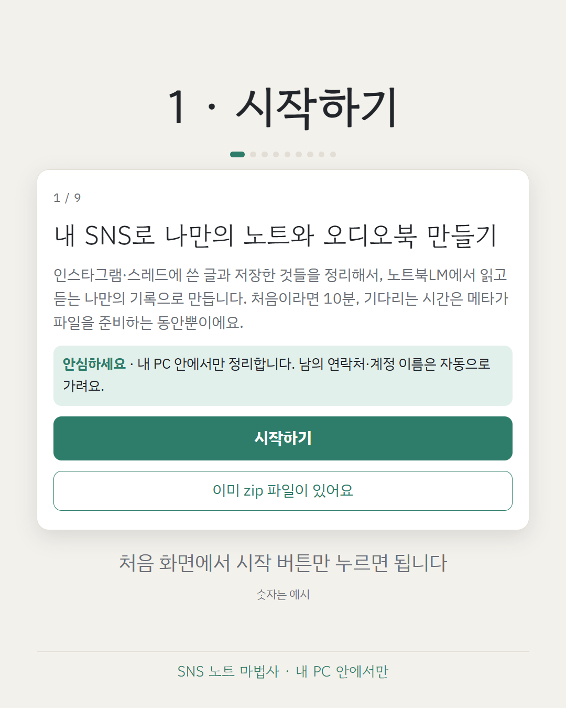
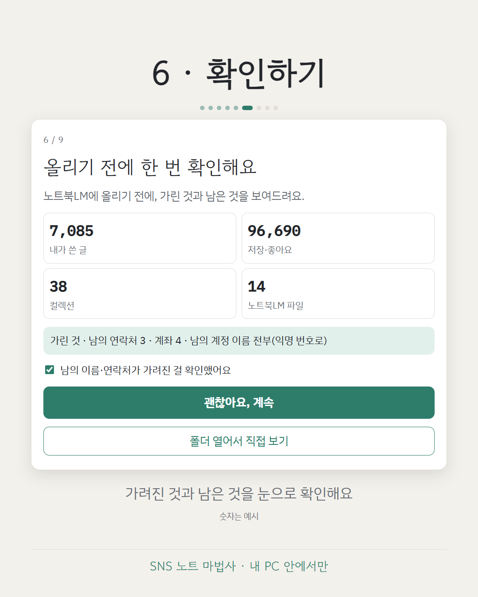

# snsnotes

[한국어](README.md)

 

Turn **your own** Instagram / Threads data export into:

- a NotebookLM-ready **"my voice" bundle** (`nlm/1_내목소리/`: your own posts, files per year; at most 45 files, each under 350k words / 50 MB, so it fits a free notebook),
- optionally (`--notes` / wizard checkbox) one Markdown note per post for Obsidian-like apps,
- plus a privacy pre-check report (no values shown).

A saved/liked ("taste") notes feature exists too, but it can be confusing for first-time users, so it **will be released separately as its own version**.

Python 3.10+, standard library only, **runs fully offline**. See [PRIVACY.md](PRIVACY.md). Korean guide (main): [README.md](README.md).

## 1. Get your export

Instagram web (checked on the Korean UI; English names in parentheses are the usual equivalents):

1. Left menu, bottom: **More** > **Settings**.
2. Top of Settings: **Accounts Center**.
3. In Accounts Center, left side under **Account settings**: **Your information and permissions**.
4. **Export your information** > **Create export**.
5. **Choose profile**: pick your Instagram account.
6. **Choose where to export**: **Export to device**. (If a screen asks which information to include, keep posts, saved, likes and Threads.)
7. On the **Export confirmation** screen the defaults are date range *Last year* and format *HTML*. **Change them: date range *All time*, format *JSON*.** Media quality: any.
8. **Start export**. Meta sends a notification email when it is ready; the download is only available for a limited time, so download it promptly. Do not unzip it.

If you export as HTML by mistake, snsnotes stops with a message asking you to export again as JSON.


## 2. Run it (no install needed)

- **Windows**: double-click `run_windows.bat` (or drag the zip onto it to pre-select it). A 9-step wizard opens in your browser.
- **macOS**: same with `run_mac.command` (first time: `chmod +x run_mac.command`).
- Command line: `python -m snsnotes wizard [--zip export.zip] [--no-browser] [--port N]`.

The wizard binds to 127.0.0.1 only, makes no outgoing connections (no web fonts either), resumes where you left off (`~/.snsnotes/state.json`), and **stops by itself when you close the browser tab** (the page pings every 15 s; 45 s of silence ends it). Nothing runs in the background. Experimental NotebookLM automation: later.

Results appear next to the zip in `<zipname>_snsnotes/`: `nlm/1_내목소리/`, `scan_report.md` (plus `notes/` only with the checkbox).

### Is this safe? (what you'll see)
- **A black window flashes for a moment.** That's `run_windows.bat` starting Python without a console. Not malware. After that you only see the browser page.
- **Windows SmartScreen ("Windows protected your PC") may appear** for files downloaded from the internet. Click *More info* → *Run anyway*, or check first:
  - Open `run_windows.bat` in Notepad — about 20 lines that only run the code in the `snsnotes` folder (plain text, no installer, nothing hidden).
  - **Turn off Wi-Fi and run it — it works the same.** Nothing is sent anywhere (only the "open Meta / NotebookLM" buttons need the internet).
  - The wizard address `http://127.0.0.1:…` means "this computer only".
  - Close the tab and it stops itself within a minute (`pythonw` disappears from Task Manager).
- Errors show a message box and go to `%USERPROFILE%\.snsnotes\wizard.log`.

## 3. Command line

```
python -m snsnotes scan   export.zip [-o report.md]
python -m snsnotes notes  export.zip -o out/   [--no-redact]
python -m snsnotes bundle export.zip -o out/   [--no-redact] [--max-chars 400000]   # -> out/1_내목소리/
python -m snsnotes all    export.zip [-o dir]  [--no-redact] [--notes]
# experimental, hidden from the wizard: taste export.zip -o out/ ; all --taste
```

**Redaction is on by default** (phones, emails, bank-account-like numbers; @mentions of other people become `@someone`, your own `--account` handle is kept; in taste notes account names seen anywhere in the export are also scrubbed from captions; **hashtags are kept** as public topic words). Use `--no-redact` to keep the original text.

### Taste notes (experimental)

Saved/liked/collections support exists in the code (`taste` command, `all --taste`, output `nlm/2_내취향/`) but is not part of this release's wizard; it will be released separately.

Common options: `--tz local|KST|+09:00|Asia/Seoul` (default: your computer's timezone; `Asia/Seoul` on Windows needs `pip install tzdata`), `--account HANDLE` (your handle: excluded from the @mention count, written to note frontmatter).

Optional install: `pip install .` gives you a `snsnotes` command.

### Output

```
nlm/1_내목소리/instagram_2024.md  instagram_2024_part2.md  threads_2024.md   # at most 45 files
notes/instagram/2024/2024-03-01_1530_ab12cd34.md   # only with --notes
```

The NotebookLM files start at ~400k characters each and grow automatically to stay within 45 files (years are kept apart if possible; otherwise several years share a file and the header lists them). If it still exceeds 45, a warning appears and `scan_report.md` says: use NotebookLM Plus or higher, or split across more notebooks. Re-running `notes` skips posts whose sha8 already exists. Missing files in the export (e.g. no Threads) produce a warning, not a crash.

## Tests

```
python -m unittest discover -s tests -v
```

Tests use a synthetic fake export (`tests/fake_export.py`); no real data is included in this repo.

## Limits

Reads feed posts and Threads text posts only (not stories, reels metadata, DMs, comments). Export layouts can change; if your zip is not recognized, open an issue with the *file list* (never the content).

## License

MIT (see LICENSE).
